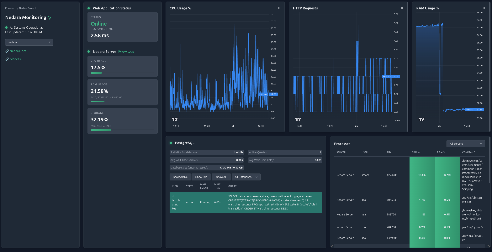

# Nedara Monitoring

A comprehensive monitoring solution for PostgreSQL databases and Linux servers.



## Overview

Nedara Monitoring is an open-source web application that provides real-time monitoring and visualization of PostgreSQL database servers and Linux systems. It offers a sleek dashboard interface displaying critical system metrics including:

- PostgreSQL database statistics, active queries, and performance metrics
- Linux server CPU, RAM, storage utilization, processes and HTTP requests (nginx)
- Real-time performance charts for tracking system resource usage
- Server logs visualization with syntax highlighting
- Web application health monitoring

## Features

- **Multi-environment support**: Switch between different environments (production, staging, etc.) with ease
- **Real-time metrics**: Live updating dashboard with configurable refresh rates
   - **Using WebSockets** to communicate with backend
- **PostgreSQL monitoring**:
  - Query tracking with filtering by state and database
  - Database size information
  - Query wait time analysis
  - Automatic detection of problematic queries
- **Linux server monitoring**:
  - CPU utilization tracking
  - Memory usage statistics
  - HTTP requests (via nginx)
  - Storage utilization
  - System logs visualization with syntax highlighting
  - Running processes
- **Status indicators** for quick system health assessment
- **Responsive dashboard** with draggable and resizable widgets
- **Performance charts** with short-term and long-term history
- **Using SQLite** to save chart data

## Installation

### Prerequisites

- Python 3.6+
- pip
- virtual environment (optional, recommended)
- PostgreSQL server(s) to monitor
- Linux server(s) to monitor
- Access credentials for the servers

### Basic Setup

1. Clone the repository:
   ```bash
   git clone https://github.com/yourusername/nedara-monitoring.git
   cd nedara-monitoring
   git submodule update --init --recursive  # Important for nedarajs and any other submodules
   ```

2. Install the required Python packages (use of `virtualenv/virtualenvwrapper` is recommended):
   ```bash
   pip install -r requirements.txt
   ```

3. Copy the example configuration file and customize it:
   ```bash
   cp config.ini.example config.ini
   ```

4. Modify `config.ini` to match your server configurations (see Configuration section below)

5. Run the application using `python3` (or alternatively `gunicorn` - do not forget to `pip install gunicorn` then):
   ```bash
   python3 app.py
   ```

### Production Deployment

For production environments, you can launch `app.py` directly via Python or use Gunicorn (for example).

You could also set up a systemd service for automatic startup and management. For instance:
   ```
   [Unit]
   Description=Nedara Monitoring
   After=network.target

   [Service]
   User=kea
   WorkingDirectory=/home/kea/nedara-monitoring
   ExecStart=/home/kea/.virtualenvs/monitoring/bin/python3 app.py
   Restart=always
   RestartSec=5
   SyslogIdentifier=nedara-monitoring

   [Install]
   WantedBy=multi-user.target
   ```

Another idea is to use Nginx as a reverse proxy (if you need it). For instance:
   ```
   server {
       listen 80;
       server_name monitoring.yourdomain.com;

       location / {
           proxy_pass http://127.0.0.1:5000;
           proxy_set_header Host $host;
           proxy_set_header X-Real-IP $remote_addr;
       }
   }
   ```

## Configuration

Nedara Monitoring uses a modular configuration file (`config.ini`) that allows you to define:

- General settings for the dashboard
- Multiple environments (production, staging, etc.)
- Server configurations for each environment

### Configuration File Structure

```ini
[general]
port = 5000  # Port used by the app
display_name = Your Monitoring Dashboard
refresh_rate = 1
chart_history = 5000  # Number of data points for charts
chart_adaptive_display = 1  # Non-adaptive display shows all points (value: 0/1)
debug = 0  # Debug mode (value: 0/1)
secret_key = your-secret-app-key
url_info = https://your-additional-url  # This is an additional URl (display purpose only)
url_info_name =  # URL display name

[environments]
available_env = staging, production
default_env = production

[staging]
url = https://your-staging-app.com  # This URL is being used to check your web app status
url_name =  # URL display name
servers = app_server_staging, db_server_staging, postgres_staging

[production]
url = https://your-production-app.com
servers = app_server_prod, db_server_prod, postgres_prod

# Linux server configuration example
[app_server_staging]
type = linux
name = Application Server
host = your_ip
user = your_ssh_user
password = your_ssh_password
log_file = /var/log/your_path/application.log
nginx_access_file = /var/log/nginx/access.log
chart_label = App CPU
chart_color = #3b82f6

# PostgreSQL configuration example
[postgres_staging]
type = postgres
name = PostgreSQL
host = your_ip
port = 5432  # Or any custom port
user = postgres_user
password = postgres_password
database = your_database
```

### Security Considerations

- Store the configuration file securely, as it contains sensitive information
- Use environment variables or a secure vault for production credentials
- Create read-only database users specifically for monitoring purposes

## Download

You can download the latest version of Nedara Monitoring from:
[Nedara Project / Nedara Monitoring](https://github.com/Nedara-Project/nedara-monitoring)

## Dependencies

Nedara Monitoring uses several libraries:

- Flask for the web application framework
    - Flask-SocketIO for WebSockets integration
- psycopg2 for PostgreSQL connections
- paramiko for SSH connections to Linux servers
- Lightweight Charts (by TradingView) for interactive charts
- GridStack for the dashboard layout
- nedarajs (included as a submodule) for UI components

## License

This project is licensed under the MIT License - see the LICENSE file for details.

## Contributing

Contributions are welcome! Please feel free to submit a Pull Request.
