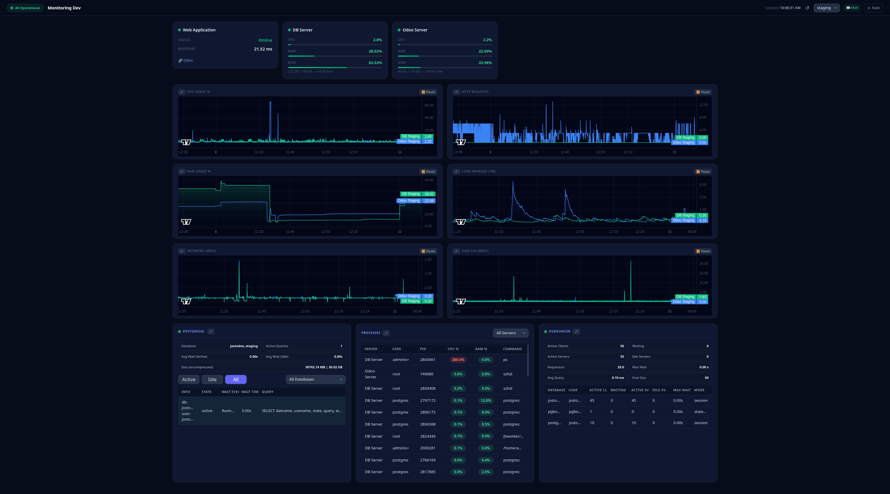
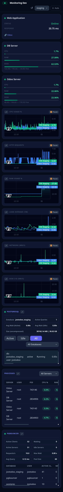

# Nedara Monitoring

A real-time monitoring dashboard for Linux servers, PostgreSQL databases, and PGBouncer connection poolers.

<p>
  
  
</p>

## Overview

Nedara Monitoring is an open-source web application that collects metrics from your infrastructure over SSH and direct database connections and displays them on a live dashboard. It is built with Flask + Flask-SocketIO on the backend and lightweight, dependency-free frontend code.

## Features

- **Multi-environment support** — switch between environments (production, staging, …) from the UI; each environment has its own collection thread and independent chart history
- **Linux server monitoring** (via SSH)
  - CPU, RAM, and disk utilization with progress bars and color coding
  - Load average (1-minute)
  - Network throughput (MB/s receive / transmit)
  - Disk I/O (MB/s read / write)
  - Running processes sorted by CPU/RAM, with colored badges
  - Nginx HTTP request rate (optional, requires access to nginx access log)
  - Application log tailing with syntax highlighting (optional)
- **PostgreSQL monitoring** (via psycopg)
  - Active and idle-in-transaction query list with wait times
  - Database size
  - Per-database filtering
  - Critical query highlighting (> 10 s)
- **PGBouncer monitoring** (via psycopg admin interface)
  - Pool statistics: active/waiting clients, active/idle servers, requests/s, max wait, avg query time
  - Per-pool breakdown table
- **Web application health check** — HTTP status + response time for a configured URL
- **Real-time charts** (LightweightCharts by TradingView) — CPU, RAM, Load Average, HTTP Requests, Network, Disk I/O
  - Historical data persisted in SQLite and reloaded on page load
  - Pause/Resume per chart
  - Fullscreen expand for each chart and panel
- **Theme** — Auto / Light / Dark, respects OS preference, persists across sessions
- **Email notifications** via SMTP — sent when a server or PostgreSQL becomes unreachable (maximum one email per 15 minutes per incident)
- **Mail indicator** in the UI when email notifications are configured

## Requirements

- Python 3.9+
- The monitored Linux servers must be reachable over SSH with password or key authentication
- The PostgreSQL user used for monitoring needs read access to `pg_stat_activity` and `pg_database`
- The PGBouncer user must be listed in `admin_users` in `pgbouncer.ini`

## Installation

### 1. Clone the repository

```bash
git clone https://github.com/Nedara-Project/nedara-monitoring.git
cd nedara-monitoring
git submodule update --init --recursive
```

> The `--recursive` flag is required to fetch the `nedarajs` UI library submodule (`static/js/lib/nedarajs`).

### 2. Create a virtual environment and install dependencies

```bash
python3 -m venv .venv
source .venv/bin/activate
pip install -r requirements.txt
```

### 3. Configure the application

```bash
cp config.ini.example config.ini
```

Edit `config.ini` to match your infrastructure (see [Configuration](#configuration) below).

### 4. Run

```bash
python3 app.py
```

The dashboard is available at `http://localhost:5000` (or whatever port you set in `[general]`).

For production, use Gunicorn:

```bash
pip install gunicorn
gunicorn --worker-class eventlet -w 1 app:app -b 0.0.0.0:5000
```

> Use exactly **1 worker** — Flask-SocketIO's threading mode requires a single worker process. Use `eventlet` or `gevent` as the worker class.

## Production Deployment

### systemd service

```ini
[Unit]
Description=Nedara Monitoring
After=network.target

[Service]
User=youruser
WorkingDirectory=/opt/nedara-monitoring
ExecStart=/opt/nedara-monitoring/.venv/bin/gunicorn --worker-class eventlet -w 1 app:app -b 127.0.0.1:5000
Restart=always
RestartSec=5
SyslogIdentifier=nedara-monitoring

[Install]
WantedBy=multi-user.target
```

```bash
sudo systemctl enable --now nedara-monitoring
```

### Nginx reverse proxy (optional)

```nginx
server {
    listen 80;
    server_name monitoring.yourdomain.com;

    location / {
        proxy_pass http://127.0.0.1:5000;
        proxy_http_version 1.1;
        proxy_set_header Upgrade $http_upgrade;
        proxy_set_header Connection "upgrade";
        proxy_set_header Host $host;
        proxy_set_header X-Real-IP $remote_addr;
    }
}
```

> The `Upgrade` / `Connection` headers are required for WebSocket (Socket.IO) to work through Nginx.

## Configuration

The application is configured via `config.ini`. Copy `config.ini.example` as a starting point.

### `[general]`

| Key | Description |
|-----|-------------|
| `port` | Port the app listens on (default: `5000`) |
| `display_name` | Title shown in the browser tab and dashboard header |
| `refresh_rate` | Seconds between metric collection cycles (default: `1`) |
| `chart_history` | Number of data points kept per chart series (default: `5000`) |
| `chart_adaptive_display` | `1` = fit chart to visible points; `0` = show all history (default: `1`) |
| `debug` | Flask debug mode — **set to `0` in production** |
| `secret_key` | Flask session secret — use a long random string |
| `url_info` | Optional URL displayed in the web app card |
| `url_info_name` | Display label for `url_info` |
| `email_notif_smtp_server` | SMTP host for alert emails |
| `email_notif_smtp_port` | SMTP port (e.g. `587` for STARTTLS) |
| `email_notif_login` | SMTP username |
| `email_notif_password` | SMTP password |
| `email_notif_recipients` | Comma-separated list of recipient addresses |

### `[environments]`

```ini
[environments]
available_env = staging, production
default_env = production
```

### Environment sections

```ini
[production]
url = https://your-app.com        ; URL checked for web application health
url_name = My App                 ; display label (optional)
servers = app1, db1, pgb1         ; comma-separated list of server section names
```

### Server types

#### `type = linux` — Linux server (SSH)

```ini
[app1]
type = linux
name = App Server                 ; display name in the dashboard
host = 192.168.1.10               ; SSH host
user = deploy                     ; SSH username
password = secret                 ; SSH password
log_file = /var/log/myapp/app.log ; optional: path to tail for the Logs button
nginx_access_file = /var/log/nginx/access.log  ; optional: enables HTTP requests chart
chart_label = App Server          ; label shown in charts (must be unique per environment)
chart_color = #3b82f6             ; line color in charts (hex)
```

> **SSH user requirements**: the user needs read access to `/proc/loadavg`, `/proc/net/dev`, `/proc/diskstats`, `/proc/meminfo`, and the ability to run `top`, `df`, `ps`. If `log_file` or `nginx_access_file` are set, the user also needs read access to those files.

#### `type = postgres` — PostgreSQL database

```ini
[db1]
type = postgres
name = PostgreSQL
host = 192.168.1.20
port = 5432
user = monitor_user
password = secret
database = mydb                   ; primary database (used for size reporting)
```

> **PostgreSQL user requirements**: the user needs the `pg_monitor` role (or equivalent `SELECT` on `pg_stat_activity`) and `CONNECT` on the target database.
>
> ```sql
> CREATE USER monitor_user WITH PASSWORD 'secret';
> GRANT pg_monitor TO monitor_user;
> GRANT CONNECT ON DATABASE mydb TO monitor_user;
> ```

#### `type = pgbouncer` — PGBouncer connection pooler

```ini
[pgb1]
type = pgbouncer
name = PGBouncer
host = 192.168.1.20
port = 6432                       ; PGBouncer listen port (default: 6432)
database = pgbouncer              ; always "pgbouncer" (the admin virtual database)
user = postgres                   ; must be listed in admin_users in pgbouncer.ini
password = secret
```

> **PGBouncer requirements**: the connecting user must be listed in `admin_users` inside `/etc/pgbouncer/pgbouncer.ini`:
> ```ini
> admin_users = postgres
> ```
> After editing, reload: `sudo systemctl reload pgbouncer`
>
> Test the connection manually:
> ```bash
> psql -h 127.0.0.1 -p 6432 -U postgres pgbouncer -c "SHOW POOLS;"
> ```

### Full example

```ini
[general]
port = 5000
display_name = Infrastructure Monitor
refresh_rate = 1
chart_history = 5000
chart_adaptive_display = 1
debug = 0
secret_key = change-me-to-a-long-random-string
url_info = https://myapp.example.com
url_info_name = My App
email_notif_smtp_server = smtp.example.com
email_notif_smtp_port = 587
email_notif_login = alerts@example.com
email_notif_password = smtppassword
email_notif_recipients = admin@example.com, ops@example.com

[environments]
available_env = staging, production
default_env = production

[staging]
url = https://staging.myapp.com
url_name = Staging
servers = app_stg, db_stg

[production]
url = https://myapp.com
url_name = Production
servers = app_prod, db_prod, pgb_prod

[app_stg]
type = linux
name = App (Staging)
host = 10.0.1.10
user = deploy
password = sshpassword
log_file = /var/log/odoo/odoo.log
nginx_access_file = /var/log/nginx/access.log
chart_label = App Staging
chart_color = #3b82f6

[db_stg]
type = postgres
name = PostgreSQL (Staging)
host = 10.0.1.11
port = 5432
user = monitor
password = pgpassword
database = mydb

[app_prod]
type = linux
name = App (Production)
host = 10.0.2.10
user = deploy
password = sshpassword
log_file = /var/log/odoo/odoo.log
nginx_access_file = /var/log/nginx/access.log
chart_label = App Production
chart_color = #10b981

[db_prod]
type = postgres
name = PostgreSQL (Production)
host = 10.0.2.11
port = 5432
user = monitor
password = pgpassword
database = mydb

[pgb_prod]
type = pgbouncer
name = PGBouncer
host = 10.0.2.11
port = 6432
database = pgbouncer
user = postgres
password = pgpassword
```

## Security

- Keep `config.ini` out of version control — it contains SSH and database credentials. Add it to `.gitignore`.
- Create dedicated read-only users for monitoring (see requirements for each server type above).
- Use a strong, random `secret_key`.
- In production, run behind Nginx with TLS and restrict access to trusted IPs.

## Dependencies

| Library | Purpose |
|---------|---------|
| Flask | Web framework |
| Flask-SocketIO | WebSocket layer |
| psycopg | PostgreSQL and PGBouncer connections (requires Python 3.9+) |
| paramiko | SSH connections to Linux servers |
| requests | Web application health checks |
| LightweightCharts (TradingView) | Interactive time-series charts (loaded from CDN) |
| Socket.IO client | WebSocket client (loaded from CDN) |
| Tailwind CSS | Layout utilities (loaded from CDN, Play mode) |
| nedarajs | UI widget framework (git submodule) |

> **Note on psycopg vs psycopg2**: This project uses `psycopg` (v3). If you are running Python < 3.9, switch to `psycopg2` — see [this commit](https://github.com/Nedara-Project/nedara-monitoring/commit/4491f85a1300a228393d9c5fb6f06b50cb7cc16e) for the required changes.

## License

MIT — see [LICENSE](./LICENSE).

## Contributing

Pull requests are welcome. Please open an issue first to discuss significant changes.
