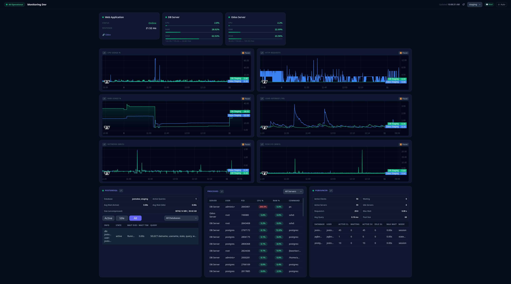

# Nedara Monitoring

A real-time monitoring dashboard for Linux servers, PostgreSQL databases, and PGBouncer connection poolers.

<p>
  
</p>

## Overview

Nedara Monitoring is an open-source web application that collects metrics from your infrastructure over SSH and direct database connections and displays them on a live dashboard. It is built with Flask + Flask-SocketIO on the backend and lightweight, dependency-free frontend code.

## Features

- **Multi-environment support** — switch between environments (production, staging, …) from the UI; each environment has its own collection thread and independent chart history
- **Linux server monitoring** (via SSH)
  - CPU, RAM, and disk utilization with progress bars and color coding
  - Mounted volumes — all non-root partitions (ext4, xfs, LVM, NFS, etc.) with individual usage bars and detail (used / total, free). Shown by default; set `show_mounts = 0` per server to hide.
  - Load average (1-minute), reported per CPU core for alerting
  - Hardware temperatures — CPU package, NVMe and SATA drives, GPU and board sensors, read from `/sys/class/hwmon` (with `/sys/class/thermal` as fallback): no agent, no extra package, no root. Dozens of raw readings are aggregated into one entry per CPU, per drive and per GPU plus the hottest few others; hosts that expose none (most VMs) simply hide the section. Set `show_temperatures = 0` per server to skip them.
  - Network throughput (MB/s receive / transmit)
  - Disk I/O (MB/s read / write)
  - Running processes sorted by CPU/RAM, with colored badges
  - Nginx HTTP request rate (optional, requires access to nginx access log)
  - Application log tailing with syntax highlighting (optional)
- **PostgreSQL monitoring** (via psycopg)
  - Active and idle-in-transaction query list with wait times
  - Database size
  - Per-database filtering
  - Critical query highlighting (> 10 s)
- **PGBouncer monitoring** (via psycopg admin interface)
  - Pool statistics: active/waiting clients, active/idle servers, requests/s, max wait, avg query time
  - Per-pool breakdown table
- **Web application health check** — HTTP status + response time for a configured URL
- **Real-time charts** (LightweightCharts by TradingView) — CPU, RAM, Load Average, HTTP Requests, Network, Disk I/O, Temperature
  - Historical data persisted in SQLite and reloaded on page load
  - Pause/Resume per chart
  - Fullscreen expand for each chart and panel
- **Theme** — Auto / Light / Dark, respects OS preference, persists across sessions
- **Threshold alerting** — every metric is compared to a configurable warning/critical threshold
  - Precise alerts: each one names the server, the metric, the measured value, the threshold it crossed, how long it has been active and the underlying detail (which volume, which query, which pool)
  - Alert panel at the top of the dashboard, sorted critical first, with a severity filter; clicking an alert jumps to the card it came from
  - Alerting cards, metric rows and volumes are highlighted in place, so the cause is visible without reading the panel
  - Thresholds resolve per scope: global `[thresholds]`, per environment, per server
  - Debounced on both edges: an issue must hold for `alert_sustain_seconds` before it is raised and stay clear for `alert_clear_seconds` before it disappears — a single CPU spike between two polls never alerts
  - Covers unreachable hosts (SSH, PostgreSQL, PGBouncer), HTTP errors and offline web applications, CPU, RAM, root disk, every mounted volume, load average per core, every hardware temperature, response time, longest active query, longest idle transaction, waiting PGBouncer clients and pool wait time
- **Email notifications** via SMTP
  - One email per collection cycle, grouping every alert that became notifiable, with the same values as the dashboard
  - Throttled **per alert** — an alert about one server never masks an alert about another
  - Escalation (warning → critical) notifies immediately, and a "resolved" email is sent when the incident clears
  - Per-environment toggle — disable alerts on staging while keeping them on production
  - Configurable alert delay, repeat interval and minimum severity
  - Mail indicator in the UI when email notifications are configured
- **Web admin interface** at `/admin` — configure the application from the browser without touching `config.ini`, in the same visual language as the dashboard (shared tokens, Auto/Light/Dark)
  - Password-protected (Werkzeug password hash stored in `config.ini`)
  - First-time setup wizard: set the password directly in the browser on first access
  - Can be disabled entirely by setting `admin_enabled = 0`

## Requirements

- Python 3.9+
- The monitored Linux servers must be reachable over SSH with password or key authentication
- The PostgreSQL user used for monitoring needs read access to `pg_stat_activity` and `pg_database`
- The PGBouncer user must be listed in `admin_users` in `pgbouncer.ini`

## Installation

> To run everything in containers instead, skip to [Docker](#docker).

### 1. Clone the repository

```bash
git clone https://github.com/Nedara-Project/nedara-monitoring.git
cd nedara-monitoring
git submodule update --init --recursive
```

> The `--recursive` flag is required to fetch the `nedarajs` UI library submodule (`static/js/lib/nedarajs`).

### 2. Create a virtual environment and install dependencies

```bash
python3 -m venv .venv
source .venv/bin/activate
pip install -r requirements.txt
```

### 3. Configure the application

```bash
cp config.ini.example config.ini
```

Edit `config.ini` to match your infrastructure (see [Configuration](#configuration) below).

### 4. Run

```bash
python3 app.py
```

The dashboard is available at `http://localhost:5000` (or whatever port you set in `[general]`).

**Optional — Gunicorn (recommended for production):**

Gunicorn is not required but provides better stability under load. If you choose to use it:

```bash
pip install gunicorn
gunicorn app:app --worker-class gthread --workers 1 --threads 24 --bind 0.0.0.0:5000
```

> Use exactly **1 worker** — Flask-SocketIO requires a single worker process, and the collection threads run inside it. The application uses SocketIO's `threading` async mode, so the multi-threaded `gthread` worker is the right class; the number of simultaneous dashboard clients is bounded by `--threads`.

## Docker

The image is built from the working directory, so the `nedarajs` submodule has to be checked out first (`git submodule update --init --recursive`, see [step 1](#1-clone-the-repository)) — the build stops with an explicit error otherwise.

### Demo stack

The repository ships a self-contained demo environment: the application, an SSH host, a PostgreSQL database, a `pgbench` load generator (so the charts have something to show) and a mail catcher.

```bash
cp docker/config.ini.demo config.ini
docker compose up --build
```

| Service | URL | Notes |
|---------|-----|-------|
| Dashboard | `http://localhost:5000` | admin interface at `/admin`, password `demo1234` |
| Monitored web app | `http://localhost:8080` | the nginx instance probed by the health check |
| Mail catcher | `http://localhost:1080` | alert emails sent by the demo environment |

Copy `.env.example` to `.env` to change the size of the generated load or the ports published on the host — `APP_PORT` and `MAILDEV_PORT`, useful when `5000` is already taken.

Everything in the demo is disposable: all credentials are `demo` / `demo` and the database lives in a tmpfs.

### Running the image on your own infrastructure

`docker compose up` also starts the demo services. To run the application alone, build the image and mount your own configuration:

```bash
docker build -t nedara-monitoring .
docker run -d --name nedara-monitoring \
    -p 5000:5000 \
    -v "$(pwd)/config.ini:/usr/local/nedara-monitoring/config.ini" \
    -v nedara-monitoring-data:/var/lib/nedara-monitoring \
    nedara-monitoring
```

- `config.ini` is bind-mounted so the admin interface can write it back. **It must exist before the first start**, otherwise Docker creates a directory in its place.
- The named volume keeps the SQLite chart history and the email throttling state across container recreations (see `NEDARA_DATA_DIR`).
- The container runs as uid 1000, which must own `config.ini` for the admin interface to be able to save it. If your user has a different uid, build with `--build-arg APP_UID=$(id -u) --build-arg APP_GID=$(id -g)`; under rootless Docker, which maps the host owner to uid 0 inside the container, build with `--build-arg APP_UID=0 --build-arg APP_GID=0`.
- The image serves the application with Gunicorn on port 5000. Put it behind the reverse proxy of your choice (see [Nginx reverse proxy](#nginx-reverse-proxy-optional)).

## Production Deployment

### systemd service

**With Gunicorn (recommended):**

```ini
[Unit]
Description=Nedara Monitoring
After=network.target

[Service]
User=youruser
WorkingDirectory=/opt/nedara-monitoring
ExecStart=/opt/nedara-monitoring/.venv/bin/gunicorn app:app --worker-class gthread --workers 1 --threads 24 --bind 127.0.0.1:5000
Restart=always
RestartSec=5
SyslogIdentifier=nedara-monitoring

[Install]
WantedBy=multi-user.target
```

**Without Gunicorn (python3 only):**

```ini
[Unit]
Description=Nedara Monitoring
After=network.target

[Service]
User=youruser
WorkingDirectory=/opt/nedara-monitoring
ExecStart=/opt/nedara-monitoring/.venv/bin/python3 app.py
Restart=always
RestartSec=5
SyslogIdentifier=nedara-monitoring

[Install]
WantedBy=multi-user.target
```

```bash
sudo systemctl enable --now nedara-monitoring
```

### Nginx reverse proxy (optional)

> The `Upgrade` / `Connection` headers are required in all configurations for WebSocket (Socket.IO) to work through Nginx.

**HTTP only:**

```nginx
server {
    listen 80;
    server_name monitoring.yourdomain.com;

    location / {
        proxy_pass http://127.0.0.1:5000;
        proxy_http_version 1.1;
        proxy_set_header Upgrade $http_upgrade;
        proxy_set_header Connection "upgrade";
        proxy_set_header Host $host;
        proxy_set_header X-Real-IP $remote_addr;
        proxy_set_header X-Forwarded-For $proxy_add_x_forwarded_for;
    }
}
```

**HTTPS with SSL (recommended for production):**

Obtain a certificate first, e.g. with Let's Encrypt:

```bash
sudo apt install certbot python3-certbot-nginx
sudo certbot --nginx -d monitoring.yourdomain.com
```

Or place your own certificate files and use the following configuration:

```nginx
# Redirect HTTP → HTTPS
server {
    listen 80;
    server_name monitoring.yourdomain.com;
    return 301 https://$host$request_uri;
}

# HTTPS
server {
    listen 443 ssl;
    server_name monitoring.yourdomain.com;

    ssl_certificate     /etc/letsencrypt/live/monitoring.yourdomain.com/fullchain.pem;
    ssl_certificate_key /etc/letsencrypt/live/monitoring.yourdomain.com/privkey.pem;

    ssl_protocols       TLSv1.2 TLSv1.3;
    ssl_ciphers         HIGH:!aNULL:!MD5;
    ssl_session_cache   shared:SSL:10m;
    ssl_session_timeout 10m;

    location / {
        proxy_pass http://127.0.0.1:5000;
        proxy_http_version 1.1;
        proxy_set_header Upgrade $http_upgrade;
        proxy_set_header Connection "upgrade";
        proxy_set_header Host $host;
        proxy_set_header X-Real-IP $remote_addr;
        proxy_set_header X-Forwarded-For $proxy_add_x_forwarded_for;
        proxy_set_header X-Forwarded-Proto $scheme;
    }
}
```

> If you use self-signed certificates, `verify = False` is already the default for the web health check in `check_web_status`. For Let's Encrypt or a trusted CA, you can remove that bypass in `app.py`.

## Configuration

The application is configured via `config.ini`. Copy `config.ini.example` as a starting point.
Alternatively, enable the [Admin interface](#admin-interface) to configure everything from the browser.

### `[general]`

| Key | Description |
|-----|-------------|
| `port` | Port the app listens on (default: `5000`) |
| `display_name` | Title shown in the browser tab and dashboard header |
| `refresh_rate` | Seconds between metric collection cycles (default: `1`) |
| `chart_history` | Number of data points kept per chart series (default: `5000`) |
| `chart_adaptive_display` | `1` = fit chart to visible points; `0` = show all history (default: `1`) |
| `debug` | Flask debug mode — **set to `0` in production** |
| `secret_key` | Flask session secret — use a long random string |
| `admin_enabled` | `1` to enable the `/admin` interface, `0` to disable it (default: `0`) |
| `admin_password` | Werkzeug password hash (see [Admin interface](#admin-interface)) |
| `email_notif_smtp_server` | SMTP host for alert emails |
| `email_notif_smtp_port` | SMTP port (e.g. `587`) — STARTTLS is used when the server advertises it |
| `email_notif_login` | SMTP username — leave empty for a relay that requires no authentication |
| `email_notif_password` | SMTP password — leave empty for a relay that requires no authentication |
| `email_notif_recipients` | Comma-separated list of recipient addresses |
| `alert_email_min_severity` | Lowest severity that triggers an email: `critical` (default) or `warning`. Warnings always show on the dashboard. |
| `alert_repeat_minutes` | Delay before the same, still-active alert is emailed again (default: `60`) |
| `alert_resolved_emails` | `1` (default) to also email when an alert clears, `0` to stay quiet |
| `alert_sustain_seconds` | How long an issue must hold before it is raised (default: `5`) |
| `alert_clear_seconds` | How long a raised alert stays visible after the condition disappears (default: `15`) |

> The five `alert_*` keys above can be repeated in an environment section to override them for that environment only.

### `[thresholds]`

Optional section. Every key is optional too — the built-in default applies when it is missing.
A metric that reaches its `*_warning` value raises a warning, its `*_critical` value a critical alert.

Thresholds resolve from the most specific scope to the least:

```
server section  >  environment section  >  [thresholds]  >  built-in default
```

so `cpu_critical = 98` inside `[app1]` only affects that server, and the same key inside
`[production]` only affects that environment.

| Key | Unit | Default | Applies to |
|-----|------|---------|------------|
| `cpu_warning` / `cpu_critical` | % | 70 / 90 | Linux server CPU usage |
| `ram_warning` / `ram_critical` | % | 70 / 90 | Linux server RAM usage |
| `disk_warning` / `disk_critical` | % | 70 / 90 | Root filesystem usage |
| `mount_warning` / `mount_critical` | % | 70 / 90 | Each mounted volume other than `/` |
| `load_warning` / `load_critical` | load per core | 1.5 / 3.0 | Load average (1m) ÷ CPU core count |
| `temp_warning` / `temp_critical` | °C | 70 / 85 | CPU package, GPU and board sensors |
| `disk_temp_warning` / `disk_temp_critical` | °C | 55 / 70 | NVMe and SATA drives, which run cooler |
| `response_time_warning` / `response_time_critical` | ms | 1000 / 5000 | Web application response time |
| `pg_active_wait_warning` / `pg_active_wait_critical` | s | 30 / 120 | Longest running active query |
| `pg_idle_tx_warning` / `pg_idle_tx_critical` | s | 120 / 600 | Longest `idle in transaction` |
| `pgb_waiting_warning` / `pgb_waiting_critical` | count | 1 / 5 | Waiting PGBouncer client connections |
| `pgb_maxwait_warning` / `pgb_maxwait_critical` | s | 1 / 5 | Longest PGBouncer client wait |

```ini
[thresholds]
cpu_warning = 70
cpu_critical = 90
ram_warning = 75
ram_critical = 92
disk_warning = 80
disk_critical = 90
```

Unreachable hosts, HTTP errors and offline web applications are always critical — they have no threshold.

### `[environments]`

```ini
[environments]
available_env = staging, production
default_env = production
```

### Environment sections

```ini
[production]
url = https://your-app.com        ; URL checked for web application health
external_url = https://app.local  ; optional: dashboard link, if different from url
url_name = My App                 ; display label (optional)
servers = app1, db1, pgb1         ; comma-separated list of server section names
send_emails = 1                   ; set to 0 to disable all alerts for this environment
alert_delay_minutes = 0           ; wait N minutes before sending (0 = immediate)
```

| Key | Description |
|-----|-------------|
| `url` | URL to health-check (HTTP GET, status 200 = healthy) |
| `external_url` | URL the dashboard link points to, when it differs from `url` — typically `url` is the address the application can reach, `external_url` the one the browser needs. Defaults to `url`. |
| `url_name` | Display label shown next to the health indicator |
| `servers` | Comma-separated list of server section names to monitor |
| `send_emails` | `1` to send alerts (default), `0` to disable — useful for staging environments |
| `alert_delay_minutes` | Minutes to wait before sending an alert email. If the issue resolves within the delay window, no email is sent. `0` = send immediately. |
| `alert_repeat_minutes`, `alert_email_min_severity`, `alert_resolved_emails`, `alert_sustain_seconds`, `alert_clear_seconds` | Same meaning as in `[general]`, applied to this environment only |
| any `[thresholds]` key | Overrides that threshold for every server of this environment |

### Server types

#### `type = linux` — Linux server (SSH)

```ini
[app1]
type = linux
name = App Server                 ; display name in the dashboard
host = 192.168.1.10               ; SSH host
port = 22                         ; optional: SSH port (default: 22)
user = deploy                     ; SSH username
password = secret                 ; SSH password
log_file = /var/log/myapp/app.log ; optional: path to tail for the Logs button
nginx_access_file = /var/log/nginx/access.log  ; optional: enables HTTP requests chart
show_mounts = 1                   ; optional: 0 hides the mounted volumes section
show_temperatures = 1             ; optional: 0 skips the hardware temperature readings
chart_label = App Server          ; label shown in charts (must be unique per environment)
chart_color = #3b82f6             ; line color in charts (hex)
```

Any `[thresholds]` key can be added to a server section to override it for that server only:

```ini
[build1]
type = linux
name = Build Machine
host = 10.0.3.10
user = deploy
password = secret
chart_label = Build
chart_color = #f59e0b
cpu_warning = 90
cpu_critical = 98
```

> **SSH user requirements**: the user needs read access to `/proc/loadavg`, `/proc/net/dev`, `/proc/diskstats`, `/proc/meminfo`, `/sys/class/hwmon` and `/sys/class/thermal`, and the ability to run `top`, `df`, `ps`, `nproc`. If `log_file` or `nginx_access_file` are set, the user also needs read access to those files. All of these are world-readable on a stock distribution — no `sudo` is required.

> **Temperatures**: SATA drives only report a temperature when the `drivetemp` kernel module is loaded (`modprobe drivetemp`, and `echo drivetemp > /etc/modules-load.d/drivetemp.conf` to make it stick). NVMe drives, CPU packages and board sensors need nothing. Set `show_temperatures = 0` on a server to skip the reading altogether.

#### `type = postgres` — PostgreSQL database

```ini
[db1]
type = postgres
name = PostgreSQL
host = 192.168.1.20
port = 5432
user = monitor_user
password = secret
database = mydb                   ; primary database (used for size reporting)
```

> **PostgreSQL user requirements**: the user needs the `pg_monitor` role (or equivalent `SELECT` on `pg_stat_activity`) and `CONNECT` on the target database.
>
> ```sql
> CREATE USER monitor_user WITH PASSWORD 'secret';
> GRANT pg_monitor TO monitor_user;
> GRANT CONNECT ON DATABASE mydb TO monitor_user;
> ```

#### `type = pgbouncer` — PGBouncer connection pooler

```ini
[pgb1]
type = pgbouncer
name = PGBouncer
host = 192.168.1.20
port = 6432                       ; PGBouncer listen port (default: 6432)
database = pgbouncer              ; always "pgbouncer" (the admin virtual database)
user = postgres                   ; must be listed in admin_users in pgbouncer.ini
password = secret
```

> **PGBouncer requirements**: the connecting user must be listed in `admin_users` inside `/etc/pgbouncer/pgbouncer.ini`:
> ```ini
> admin_users = postgres
> ```
> After editing, reload: `sudo systemctl reload pgbouncer`
>
> Test the connection manually:
> ```bash
> psql -h 127.0.0.1 -p 6432 -U postgres pgbouncer -c "SHOW POOLS;"
> ```

### Full example

```ini
[general]
port = 5000
display_name = Infrastructure Monitor
refresh_rate = 1
chart_history = 5000
chart_adaptive_display = 1
debug = 0
secret_key = change-me-to-a-long-random-string
admin_enabled = 1
admin_password =
email_notif_smtp_server = smtp.example.com
email_notif_smtp_port = 587
email_notif_login = alerts@example.com
email_notif_password = smtppassword
email_notif_recipients = admin@example.com, ops@example.com
alert_email_min_severity = critical
alert_repeat_minutes = 60
alert_resolved_emails = 1

[thresholds]
cpu_warning = 70
cpu_critical = 90
ram_warning = 75
ram_critical = 92
disk_warning = 80
disk_critical = 90
mount_warning = 80
mount_critical = 92

[environments]
available_env = staging, production
default_env = production

[staging]
url = https://staging.myapp.com
url_name = Staging
servers = app_stg, db_stg
send_emails = 0
alert_delay_minutes = 0

[production]
url = https://myapp.com
url_name = Production
servers = app_prod, db_prod, pgb_prod
send_emails = 1
alert_delay_minutes = 2

[app_stg]
type = linux
name = App (Staging)
host = 10.0.1.10
user = deploy
password = sshpassword
log_file = /var/log/odoo/odoo.log
nginx_access_file = /var/log/nginx/access.log
chart_label = App Staging
chart_color = #3b82f6

[db_stg]
type = postgres
name = PostgreSQL (Staging)
host = 10.0.1.11
port = 5432
user = monitor
password = pgpassword
database = mydb

[app_prod]
type = linux
name = App (Production)
host = 10.0.2.10
user = deploy
password = sshpassword
log_file = /var/log/odoo/odoo.log
nginx_access_file = /var/log/nginx/access.log
chart_label = App Production
chart_color = #10b981

[db_prod]
type = postgres
name = PostgreSQL (Production)
host = 10.0.2.11
port = 5432
user = monitor
password = pgpassword
database = mydb

[pgb_prod]
type = pgbouncer
name = PGBouncer
host = 10.0.2.11
port = 6432
database = pgbouncer
user = postgres
password = pgpassword
```

### Environment variables

Optional — everything else is configured in `config.ini`.

| Variable | Description |
|----------|-------------|
| `NEDARA_DATA_DIR` | Directory holding the SQLite chart history and the email throttling state. Defaults to the application directory; the Docker image points it at `/var/lib/nedara-monitoring`. |
| `NEDARA_START_COLLECTORS` | Set to `0` to import `app.py` without starting any collection thread. Unset (the default) starts one thread per environment, both with `python3 app.py` and behind a WSGI server. |

## Admin interface

The `/admin` page lets you configure the application from the browser without editing `config.ini` manually.

### Enabling the admin interface

Set `admin_enabled = 1` in `config.ini` and restart. The interface is disabled by default.

### Setting the admin password

**Option A — First-time setup (browser)**

Leave `admin_password` empty in `config.ini`. On your first visit to `/admin`, you will be prompted to set a password. The hash is then saved automatically.

**Option B — CLI hash generation**

Generate a hash and paste it directly into `config.ini`:

```bash
python3 -c "from werkzeug.security import generate_password_hash; print(generate_password_hash('yourpassword'))"
```

Then set:

```ini
[general]
admin_enabled = 1
admin_password = scrypt:32768:8:1$...   ; paste the full hash here
```

### What the admin panel covers

| Tab | Settings |
|-----|----------|
| **General** | Display name, refresh rate, chart history, adaptive display, debug mode |
| **Email** | SMTP server/port/login/password/recipients |
| **Alerts** | Every warning/critical threshold, plus the per-environment notification behaviour (`send_emails`, delay, repeat interval, minimum severity, resolved emails, sustain/clear windows) |
| **Servers** | Host, credentials, chart labels/colors, log file paths for each configured server |
| **Admin** | Enable/disable the interface, change the admin password |

> Adding or removing environments and servers still requires editing `config.ini` and restarting. The admin panel covers settings that can change at runtime.

### Disabling the admin interface

Set `admin_enabled = 0` (or remove the key). `/admin` will return a `403` immediately without revealing whether an admin exists.

## Security

- Keep `config.ini` out of version control — it contains SSH and database credentials. Add it to `.gitignore`.
- Create dedicated read-only users for monitoring (see requirements for each server type above).
- Use a strong, random `secret_key`.
- In production, run behind Nginx with TLS and restrict access to trusted IPs.
- The admin interface is protected by a Werkzeug password hash. Never share or expose the hash directly.

## Dependencies

| Library | Purpose |
|---------|---------|
| Flask | Web framework |
| Flask-SocketIO | WebSocket layer |
| Werkzeug | Password hashing for the admin interface |
| psycopg | PostgreSQL and PGBouncer connections (requires Python 3.9+) |
| paramiko | SSH connections to Linux servers |
| requests | Web application health checks |
| LightweightCharts (TradingView) | Interactive time-series charts (loaded from CDN) |
| Socket.IO client | WebSocket client (loaded from CDN) |
| Inter + JetBrains Mono | Interface and numeric fonts (loaded from Google Fonts) |
| Font Awesome | Interface icons (loaded from CDN) |
| nedarajs | UI widget framework (git submodule) |

The stylesheets are plain CSS, no build step: `static/css/nedara-base.css` holds the design
tokens shared by every page, `monitoring.css` the dashboard and `admin.css` the configuration
panel. Both pages read the same light/dark tokens, so the two interfaces stay visually in sync.

> **Note on psycopg vs psycopg2**: This project uses `psycopg` (v3). If you are running Python < 3.9, switch to `psycopg2` — see [this commit](https://github.com/Nedara-Project/nedara-monitoring/commit/4491f85a1300a228393d9c5fb6f06b50cb7cc16e) for the required changes.

## License

MIT — see [LICENSE](./LICENSE).

## Contributing

Pull requests are welcome. Please open an issue first to discuss significant changes.
